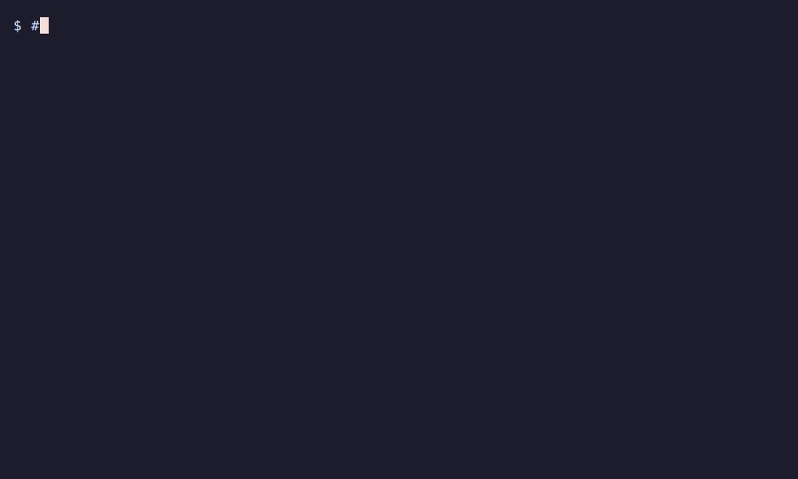

# Nyia Keeper

Run AI coding agents on your machine — **without handing them your secrets.** Each assistant works in
your project inside a Docker container, but **sensitive files (`.env`, `*.key`, `id_rsa`, `.ssh/`,
`.aws/`, `credentials.*`, …) are auto-detected and kept out of its reach** by default, you **share only
what you choose**, and it's **git-safe by default** (work branches + protected-branch guards). On top of
that, a repeatable **plan → review → implement → checkpoint** workflow so agents run on a process, not on
vibes.

This isn't VM-grade escape isolation — Docker's own Sandboxes do microVMs if that's what you need. Nyia
is about **controlling what the AI sees and can touch on your machine**, with opinionated safe defaults.

> A personal project, shared as-is. I build it for myself and use it daily — Claude Code and Gemini day
> to day (also Codex, opencode, vibe).

<!-- Demo GIFs rendered from docs/demo/*.tape (Plan 311); ship to the public repo via dist/runtime. -->


## What you get

- **Your secrets stay yours.** `.env`, keys, `id_rsa`, `.ssh/`, `.aws/`, `credentials.*` and more are
  excluded from the container mount by default and replaced with a read-only placeholder — the agent
  literally can't read them. Tune it per project (`!.env.example` to keep one visible).
- **Git-safe by default.** Runs inside a Git repo, on a work branch, with protected-branch guards — an
  agent can't quietly rewrite `main` or trash your tree. (Use `--skip-checks` if you really want to opt out.)
- **A workflow, not vibes.** `make-a-plan → plan-review → implement → code-review → checkpoint`, with the
  plan and context kept in the repo, so the next session resumes exactly where the last one stopped.

  
- **One setup across assistants.** Claude Code and Gemini day to day; Codex/opencode/vibe when you want them.

  

## Quick start

```bash
curl -fsSL https://raw.githubusercontent.com/KaizendoFr/nyia-keeper/main/install.sh | bash
nyia-claude --login
nyia-claude
```

→ **Requirements & per-OS setup:** <https://nyia-keeper.com/REQUIREMENTS/> · [Quick Start](QUICKSTART.md)

## Support & contributing

Best-effort. **Bug reports, questions, and ideas are welcome via
[Issues](https://github.com/KaizendoFr/nyia-keeper/issues) and
[Discussions](https://github.com/KaizendoFr/nyia-keeper/discussions).**
I'm **not taking pull requests** — development happens in a private repo, so this one is
distribution-only. It's licensed **AGPL-3.0-or-later OR Proprietary**.

A tool I like, not a product.

## Links

- **Docs:** <https://nyia-keeper.com>
- **Security model:** [SECURITY.md](SECURITY.md) — what's protected, and what "hardened container, not a VM" means
- **License:** AGPL-3.0-or-later OR Proprietary — see [LICENSE](LICENSE)
